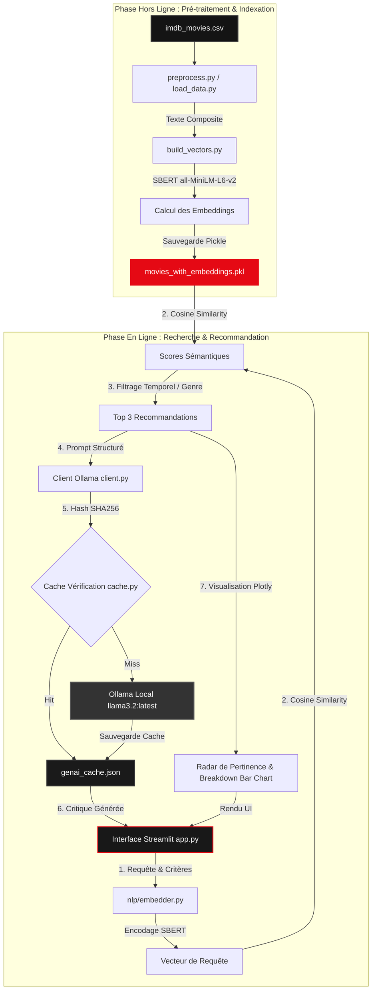

# CineMatch - Assistant Cinéma par IA Générative 🍿

[](https://www.python.org/)
[](https://streamlit.io/)
[](https://huggingface.co/sentence-transformers/all-MiniLM-L6-v2)
[](https://ollama.com/)
[](https://github.com/Sglinggling/Projet-GenAI)

**CineMatch** est un moteur de recommandation de films intelligent combinant **Recherche Sémantique (SBERT)** et **IA Générative (LLM local)**. Contrairement aux filtres de recherche classiques, il comprend l'intention sémantique de l'utilisateur ("Je cherche un thriller psychologique sombre et pluvieux...") pour identifier les films les plus proches et générer des critiques personnalisées et argumentées.

Ce projet a été réalisé en binôme par **[Samy HALIT (Sglinggling)](https://github.com/Sglinggling)** et **[Ananda CASSINI (ananda3cassini)](https://github.com/ananda3cassini)** dans le cadre du cours *Data Engineering & AI*.

---

## 🚀 Fonctionnalités Clés

* **Recherche Sémantique (RAG)** : Utilisation de `Sentence-BERT` (modèle `all-MiniLM-L6-v2`) pour encoder les résumés et métadonnées des films, ainsi que la requête de l'utilisateur.
* **Base Vectorielle Locale Optimisée** : Ingestion et vectorisation uniques via un script d'indexation. Stockage au format optimisé **Pickle** pour des recherches instantanées (< 50ms).
* **Génération Augmentée de Contenu (RAG/LLM)** : Utilisation du modèle **Ollama** en local (`llama3.2`) pour analyser le profil cinéphile et justifier les recommandations avec un ton expert.
* **Cache Intelligent** : Système de cache local persistant (`genai_cache.json`) avec hachage SHA256 pour éviter les requêtes LLM redondantes et accélérer l'expérience utilisateur.
* **Visualisations Avancées (Plotly)** :
  * *Radar de Pertinence* : Une cible interactive montrant à quel point les recommandations sont proches de votre intention.
  * *Breakdown Sémantique* : Un graphique à barres découpant le score de pertinence selon trois axes : l'histoire, l'ambiance et le genre.
* **Interface Premium* : Design sombre inspiré des plateformes de streaming avec des composants stylisés en CSS pur (`assets/style.css`).

---

## 📐 Architecture Technique



### Structure du Code
* `src/data/` : Chargement et nettoyage du dataset IMDB, script de calcul des vecteurs.
* `src/nlp/` : Chargement du modèle de plongement lexical (SBERT).
* `src/recommender/` : Calcul du score de similarité cosinus.
* `src/genai/` : Intégration du LLM local (Ollama) et gestion du cache.
* `src/ui/` : Interface utilisateur Streamlit personnalisée.
* `assets/` : Feuilles de style CSS personnalisées.

---

## 🛠️ Installation & Démarrage

### 1. Cloner le Projet
```bash
git clone https://github.com/Sglinggling/Projet-GenAI.git
cd Projet-GenAI
```

### 2. Installer les Dépendances
```bash
pip install -r requirements.txt
```

### 3. Configurer Ollama en Local
* Installez [Ollama](https://ollama.com/) et téléchargez le modèle par défaut :
  ```bash
  ollama run llama3.2
  ```
* Assurez-vous que l'instance Ollama tourne en local (sur `http://localhost:11434`).

### 4. Générer les Vecteurs (Recommandé)
Avant de lancer l'application, calculez la base vectorielle locale en exécutant :
```bash
python src/data/build_vectors.py
```
Cela générera le fichier `movies_with_embeddings.pkl` dans le dossier `src/data/processed/`.

### 5. Lancer l'Application
Démarrez l'application web Streamlit :
```bash
streamlit run src/ui/app.py
```
